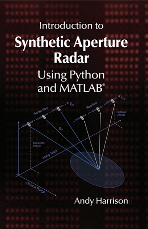

## Ordering Information

## Artech House
ISBN: 9781630818647 

Copyright: 2022

[Order Now](https://us.artechhouse.com/Introduction-to-Synthetic-Aperture-Radar-Using-Python-and-MATLAB-P2293.aspx)

## Python®

The Python tools were developed with [Google Colab](https://colab.research.google.com/notebooks/intro.ipynb).  The  tool  suite  makes  use  of  packages  including  SciPy,  NumPy and  Matplotlib. 

## MATLAB®

The MATLAB Live Editor scripts associated with this  text  were  developed  with  R2020b  and  do  not  require  any  additional  toolboxes. The folder structure for the MATLAB and Python scripts is identical.  or more information on MATLAB visit [MathWorks®](https://www.mathworks.com/).

## DATA
Data for examples are hosted by AFRL's [Sendor Data Management System](https://www.sdms.afrl.af.mil/index.php), provided by [ICEYE](https://www.iceye.com/), and [Tripoint Industries](http://tripointindustries.com/).
